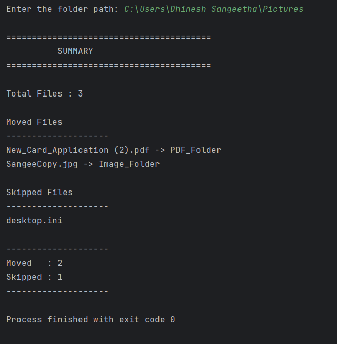

# Smart File Organizer

## Overview

A Python automation project that organizes files into folders based on their extensions.

## Features

- Automatically creates folders
- Moves files
- Skips unsupported files
- Displays a summary
- Handles exceptions

## Technologies

- Python
- pathlib
- shutil
- os

## Folder Structure

smart-file-organizer
│
├── organizer.py
├── README.md
├── requirements.txt
├── .gitignore
├── sample_files/
├── sample_output/
└── logs/

## How to Run

python organizer.py

## Sample Input

C:\Users\User\PycharmProjects\smart-file-organizer\sample_files

## Sample Output

## Extension available
- .txt : "Text"
- .jpg : "Image"
- .pdf : "PDF",
- .mp3 : "Music",
- .mp4 : "Movies",
- .zip : "Archives",
- .xlsx: "Excel",
- .png : "Screenshot"

## Future Improvements

- Logging
- CLI arguments
- Undo
- Recursive scan